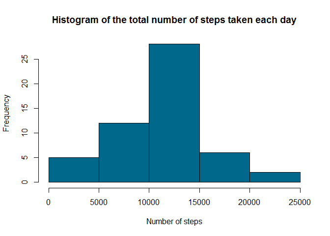
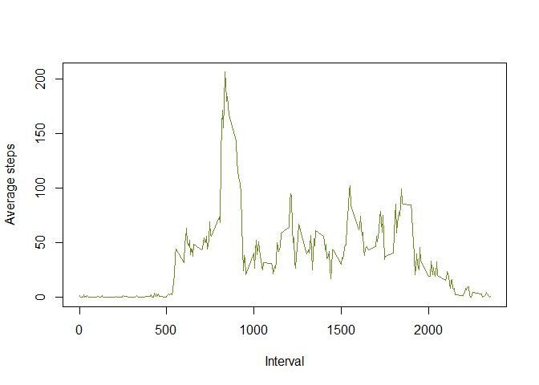
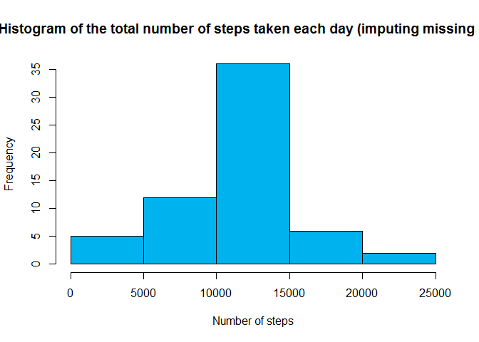

# Reproducible Research: Peer Assessment 1


## Loading and preprocessing the data
  
  1- Load the data

```r
  data.with.na <- read.csv("~/activity.csv", header = TRUE, na.strings = "NA")
```

  2- Process/transform the data

```r
  data <- na.omit(data.with.na)
  data$date <- as.Date(data$date,"%Y-%m-%d")
```

## What is mean total number of steps taken per day?

 1- Calculate the total number of steps taken per day  

```r
  step.per.date <- aggregate(steps~date, data, sum)
  hist(step.per.date$steps, breaks=5, col="deepskyblue4",
     xlab="Number of steps", main="Histogram of the total number of steps taken each day")
```



 2- Calculate and report the mean and median of the total number of steps taken per day

```r
  meanspd <- mean(step.per.date$steps)
  meanspd
```

```
## [1] 10766.19
```

```r
  medianspd <- median(step.per.date$steps)
  medianspd
```

```
## [1] 10765
```

## What is the average daily activity pattern?

  1- Make a time series plot

```r
  interval.step <- aggregate(steps ~ interval, data, mean)
  plot(interval.step$interval, interval.step$steps, type='l', col="olivedrab4", 
       xlab="Interval", ylab="Average steps")
```



  2- Which 5-minute interval, on average across all the days in the dataset, contains the maximum number of steps?

```r
  interval.step[interval.step$steps == max(interval.step$steps),]
```

```
##     interval    steps
## 104      835 206.1698
```

## Imputing missing values

  1- Calculate and report the total number of missing values in the dataset

```r
  sum(is.na(data.with.na$steps))
```

```
## [1] 2304
```
  
  2- Devise a strategy for filling in all of the missing values in the dataset. 
  
  I'm not success with using mean/median for that day but for that 5-minute interval.


```r
data.fill.na <- data.with.na
  for (i in 1:nrow(data.with.na)) {
    if (is.na(data.with.na$steps[i])) {
      interval.mean <- data.fill.na$interval[i]
      steps.mean <- interval.step[interval.step$interval == interval.mean,]
      data.fill.na$steps[i] <- steps.mean$steps
    }
  }
```

  3- Create a new dataset that is equal to the original dataset but with the missing data filled in.

```r
# new.dataset is named "data.fill.na"   
```
  
  4- Make a histogram of the total number of steps taken each day and Calculate and report the mean and median total number of steps taken per day. Do these values differ from the estimates from the first part of the assignment? What is the impact of imputing missing data on the estimates of the total daily number of steps?

```r
  s.p.d <- aggregate(steps~date, data.fill.na, sum)
  hist(s.p.d$steps, breaks=5, col="deepskyblue2",
     xlab="Number of steps", main="Histogram of the total number of steps taken each day (imputing missing data")
```




```r
  means.p.d <- mean(s.p.d$steps)
  means.p.d
```

```
## [1] 10766.19
```

```r
  medians.p.d <- median(s.p.d$steps)
  medians.p.d
```

```
## [1] 10766.19
```
## Are there differences in activity patterns between weekdays and weekends?

  1- Create a new factor variable in the dataset with two levels - "weekday" and "weekend" indicating whether a given date is a weekday or weekend day.

```r
  # I use package "timeDate" to label a date weekday or weekend
   library(timeDate) # You should install this package before using 
```


```r
  data.fill.na$factor <-  ifelse(isWeekday(data.fill.na$date, wday=1:5), "weekday", "weekend")
  data.fill.na$factor <- as.factor(data.fill.na$factor)
```
  
  2- Make a panel plot containing a time series plot (i.e. type = "l") of the 5-minute interval (x-axis) and the average number of steps taken, averaged across all weekday days or weekend days (y-axis).

```r
  interval.step.fill.na <- aggregate(steps ~ interval + factor, data.fill.na, mean)
  library(lattice)
  xyplot(steps ~ interval | factor , interval.step.fill.na , type="l", lwd=1, 
       xlab="Interval", ylab="Number of steps", layout=c(1,2))
```


